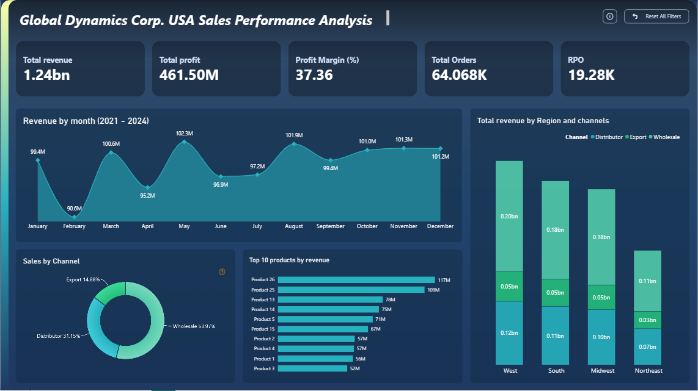

#  Global Dynamics Corp. USA Sales Performance Analysis (2021–2025)

##  Project Summary

This project is a comprehensive **Sales Performance Analysis** for **Global Dynamics Corp. (USA Division)** between 2021 and 2025. It combines powerful **Python-based Exploratory Data Analysis (EDA)** with an **interactive Power BI dashboard** to uncover insights about revenue, profit, customer trends, and regional performance.

The goal is to equip stakeholders with a strategic view of sales metrics and identify opportunities for market optimization and revenue growth.

---

##  Key Business Objectives

-  Identify **top-performing products** and **high-margin segments**
-  Evaluate **sales channel efficiency**
-  Analyze **regional performance** and market saturation
-  Understand **seasonality**, outliers, and customer behavior
-  Compare **revenue vs. budget** allocations
-  Build **visually interactive dashboards** for decision-makers

---

## Dataset Overview

The dataset consists of 6 Excel sheets:

| Sheet Name    | Description                   |
| ------------- | ----------------------------- |
| Sales Orders  | Transaction-level order data  |
| Customers     | Customer ID mapping           |
| Products      | Product ID mapping            |
| Regions       | Delivery region information   |
| State Regions | State-to-region relationships |
| 2017 Budgets  | Budget allocated to products  |

---

## 🗂 Data Preprocessing Steps

-  Merged 6 sheets into a unified sales dataset  
-  Handled missing budgets and corrected schema  
-  Converted date columns and extracted month/year  
-  Created new columns: `total_cost`, `profit`, `profit_margin_pct`  
-  Excluded year 2025 for historical insights  
-  Saved cleaned dataset as `sales_data.csv` and `Sales_data(After EDA).csv`  

---

##  Exploratory Data Analysis (Python)

**Libraries Used**: `pandas`, `matplotlib`, `seaborn`, `plotly`

### Key Visualizations:

| Visualization          | Insight                                          |
| ---------------------- | ------------------------------------------------ |
|  Monthly Sales Trend | Revenue stability with early 2024 dip            |
|  Top 10 Products     | Products 26, 25, 13 lead in revenue              |
|  Regional Sales      | West & South dominate revenue                    |
|  Channel Mix         | Wholesale (54%), Distributor (31%), Export (15%) |
|  Product Pricing     | Scatter of unit price vs. profit margin          |
|  Correlation Matrix  | Relationships between key numerical variables    |
|  USA Choropleth      | Revenue by state with Plotly                     |

---

##  Power BI Dashboard (Visual Layer)

### Dashboard Sections:

- **KPIs**: Total Revenue, Profit, Margin %, Orders, RPO  
- **Line Chart**: Monthly revenue trend (2021–2024)  
- **Donut Chart**: Revenue by channel  
- **Bar Chart**: Top 10 products by revenue  
- **Stacked Bar**: Revenue by Region & Channel  
- **Interactive Filters**: Reset and explore features  

---

##  Key Insights

-  **2024 Dip**: Early 2024 shows a sharp revenue drop (~$21.2M)  
-  **Channel Breakdown**:  
  - Wholesale: **54%**  
  - Distributors: **31%**  
  - Export: **15%**  
-  **Top Products**:  
  - Product 26: 117M  
  - Product 25: 109M  
-  **Top States**:  
  - California: ~230M, 7500+ orders  
  - Texas, Illinois, Florida: 85M–110M  
-  **Profit Margins**: Ranges from 18–60%, independent of unit price  

---

